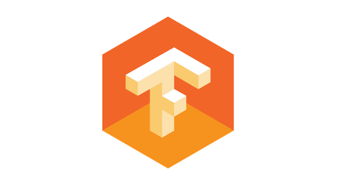
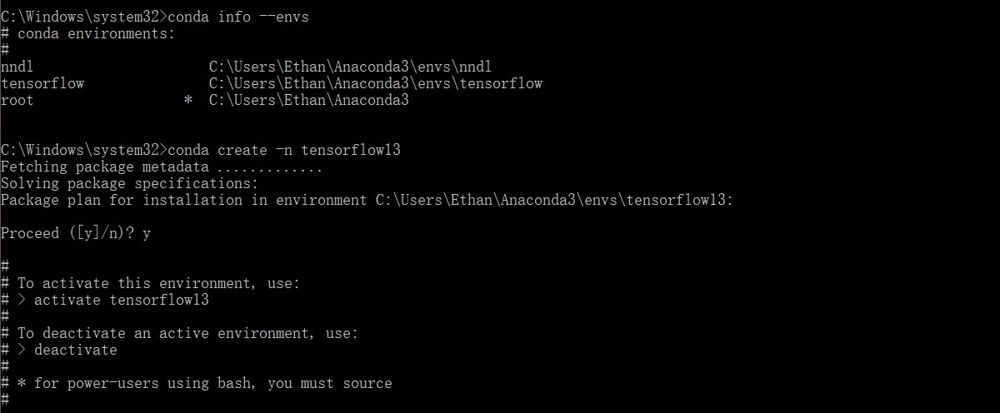
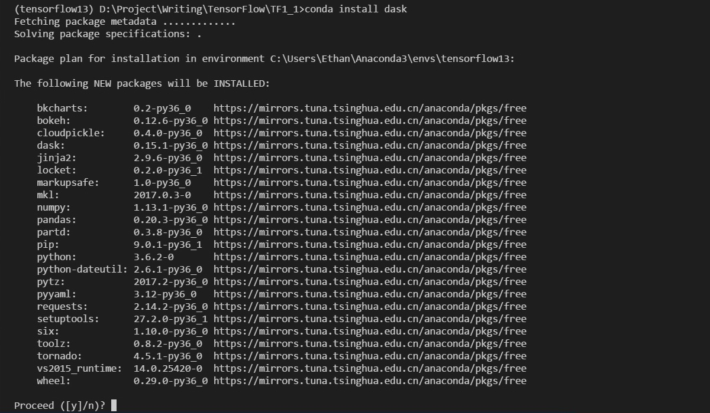
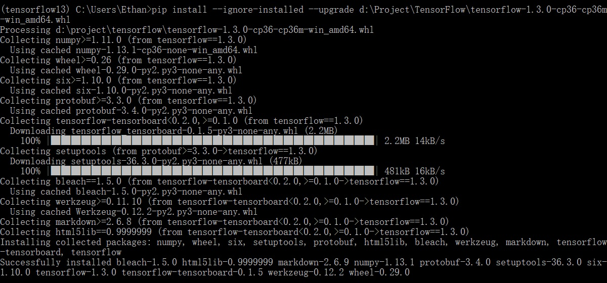

# 18 升级手记：TensorFlow 1.3.0

《TensorFlow从0到1》写到现在，TensorFlow的版本也从当时的1.1.0迭代到了8月初发布的[1.3.0](https://github.com/tensorflow/tensorflow/blob/r1.3/RELEASE.md)。可以预见在未来很长一段时间里，它仍会持续快速的迭代更新。

除了考虑与最新版TensorFlow尽量保持同步之外，鉴于conda虚拟环境可以非常容易的重新构建开发环境，并可以和老的并存，所以对于学习者来说，似乎没有什么理由不下手了。

本篇基于[1 Hello,TensorFlow!](./1-Hello,TensorFlow!.md)，在Windows环境下安装CPU版TensorFlow 1.3.0。

## Step 1：新建conda虚拟环境

在[1 Hello,TensorFlow!](./1-Hello,TensorFlow!.md)中创建了conda虚拟环境“tensorflow” for 1.1.0。为了保留它，我以“tensorflow13”命名新的conda虚拟环境for 1.3.0：

	C:> conda create -n tensorflow13

## Step 2：升级Python到3.6.1+

从TensorFlow 1.2.0开始支持了Python 3.6.x，在上一节创建conda虚拟环境“tensorflow13”时没有特别指定Python版本，所以此时我的Python版本是Anaconda 4.3.1的默认搭配3.6.0。

可是Python3.6.0并不行。TensorFlow 1.3.0会安装依赖Numpy的1.13.1版本，这个版本在Python3.6.0下会产生问题：[Importing the multiarray numpy extension module failed](https://github.com/numpy/numpy/issues/9272)。

解决上面问题一个简单可行的办法就是升级Python到3.6.1+，我则直接更新到了最新的3.6.2：
	
	activate tensorflow13
	conda update python

## Step 3：升级dask

现在还是不要着急安装TensorFlow 1.3.0，否则可能会遇到新问题：“AttributeError: module 'pandas' has no attribute 'computation'”。

解决它的一个简单办法就是升级[dask](https://github.com/dask/dask)到0.15.1：

	conda install dask

## Step 4：安装TensorFlow 1.3.0

终于到安装TensorFlow 1.3.0了！遗憾的是清华大学开源软件镜像站迟迟未提供[TensorFlow 1.3.0 Windows版本安装包](https://mirrors.tuna.tsinghua.edu.cn/tensorflow/windows/cpu/)（Linux和Mac下没有这个问题），而只提供了1.3.0rc0的版本。

另一个提供TensorFlow安装包的源是[Python的官网](https://pypi.python.org/pypi/tensorflow)，可以先将CPU版安装包[tensorflow-1.3.0-cp36-cp36m-win_amd64.whl](https://pypi.python.org/packages/bf/d4/80197f48f9fb90a17c47cdd834b2f13d5f714f26e8ed5c77069d57aa3ecb/tensorflow-1.3.0-cp36-cp36m-win_amd64.whl#md5=3a7dbe9a17d806e43d2e71b3ddb0cd52)下载到本地，然后执行本地安装：

	pip install --ignore-installed --upgrade D:\Project\TensorFlow\tensorflow-1.3.0-cp36-cp36m-win_amd64.whl

## Hello, TensorFlow

在虚拟环境tensorflow13中，启动python，运行以下测试：

	$ python
	>>> import tensorflow as tf
	>>> hello = tf.constant('Hello, TensorFlow!')
	>>> sess = tf.Session()
	>>> print(sess.run(hello))
	
打印成功则表示安装成功。

## 代码迁移

本系列的示例代码存放在[GitHub](https://github.com/EthanYuan/TensorFlow/)，其中文件夹命名的含义如下:

- **TF1_1**：TensorFlow 1.1.0下运行的代码；
- **TF1_3**：TensorFlow 1.3.0下运行的代码；

本篇之前的示例代码都在文件夹TF1_1中（大多数都可以在TensorFlow 1.3.0环境下无需修改直接运行），后面新的示例代码都会在TensorFlow 1.3.0下测试并提交到TF1_3中。