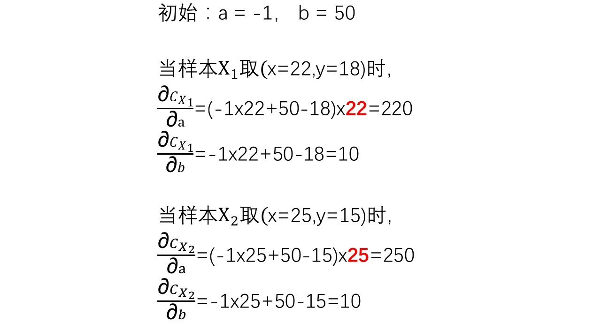
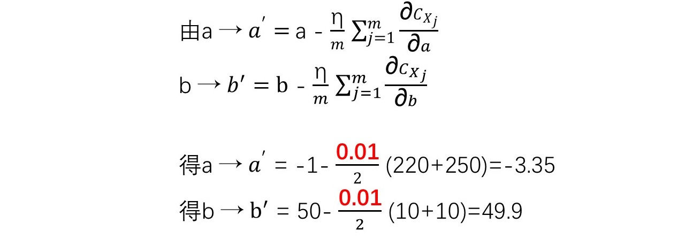
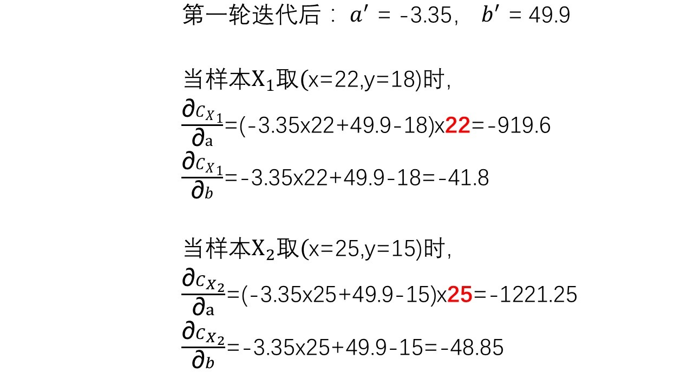
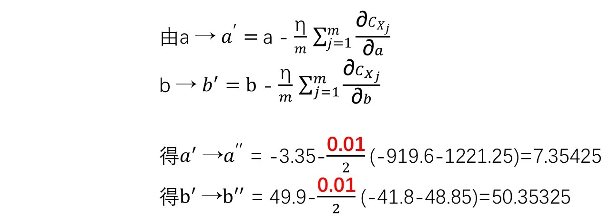

# 7 TF线性回归的参数溢出之坑

[上一篇 6 解锁梯度下降算法](./6-解锁梯度下降算法.md)，解释清楚了学习率（learning rate）。本篇基于对梯度下降算法和学习率的理解，去填下之前在线性回归中发现的一个坑。

在[5 TF轻松搞定线性回归](./5-TensorFlow轻松搞定线性回归.md)中提到，只要把TF官方Get Started中线性回归例子中的训练数据换一下，就会出现越训练“损失”越大，直到模型参数都stackoverflow的情况。然而更换训练数据是我们学习代码的过程中再普通不过的行为，从stackoverflow.com上也能搜到很多人做了类似的尝试而遇到了这个问题。到底为什么这么经不住折腾？马上摊开看。

更换训练数据如下：

- 参数初始值a=-1，b=50；
- 训练数据x_train = [22, 25]；
- 训练数据y_train = [18, 15]。

先亮个底：给出的训练数据只有两组但足够了，两点成一线，要拟合的直线心算下就能得出是y=-x+40，a是-1，b是40。

运行使用新数据的代码：

	import tensorflow as tf
	
	# model parameters
	a = tf.Variable([-1.], tf.float32)
	b = tf.Variable([50.], tf.float32)
	
	# model input and output
	x = tf.placeholder(tf.float32)
	linear_model = a * x + b
	y = tf.placeholder(tf.float32)
	
	# loss
	loss = tf.reduce_sum(tf.square(linear_model - y)) / 4   # sum of the squares
	
	# training data
	x_train = [22, 25]
	y_train = [18, 15]
	
	# optimizer
	optimizer = tf.train.GradientDescentOptimizer(0.01)
	train = optimizer.minimize(loss)
	
	# training loop
	init = tf.global_variables_initializer()
	sess = tf.Session()
	sess.run(init)
	for i in range(10):
	    sess.run(train, {x: x_train, y: y_train})
	    curr_a, curr_b, curr_loss = sess.run([a, b, loss], {x: x_train, y: y_train})
	    print("a: %s b: %s loss: %s" % (curr_a, curr_b, curr_loss))
	
	# evaluate training accuracy
	curr_a, curr_b, curr_loss = sess.run([a, b, loss], {x: x_train, y: y_train})
	print("a: %s b: %s loss: %s" % (curr_a, curr_b, curr_loss))

为了方便观察，让程序训练了10次，输出是：

	a: [-3.3499999] b: [ 49.90000153] loss: 1033.39
	a: [ 7.35424948] b: [ 50.35325241] loss: 21436.4
	a: [-41.40307999] b: [ 48.28647232] loss: 444752.0
	a: [ 180.68467712] b: [ 57.69832993] loss: 9.22756e+06
	a: [-830.91589355] b: [ 14.8254509] loss: 1.9145e+08
	a: [ 3776.88330078] b: [ 210.10742188] loss: 3.97214e+09
	a: [-17211.45703125] b: [-679.39624023] loss: 8.24126e+10
	a: [ 78389.59375] b: [ 3372.25512695] loss: 1.70987e+12
	a: [-357069.3125] b: [-15082.85644531] loss: 3.54758e+13
	a: [ 1626428.5] b: [ 68979.421875] loss: 7.36039e+14
	a: [ 1626428.5] b: [ 68979.421875] loss: 7.36039e+14

参数越练损失越大的趋势果然重现了。

现在我们已经掌握了梯度下降大法，就来看看每次训练的结果到底是怎么产生的。

---

---

手工计算了两次迭代，和程序输出一致。

图中显示，训练样本（已红色标出）的值对梯度值的贡献很大，而此时沿用之前的学习率η=0.01就显得不够小了。训练样本既然不可调，那么显然只能调小学习率了。随之而来的副作用就是会导致学习缓慢，所以还得增加训练的次数。这就是之前的例子中最终调整为η=0.0028，epoch=70000的原因了。

如此看来，这的确不是TF的bug。再一次体会：**训练是一门艺术**。