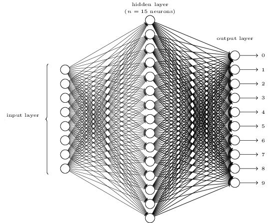
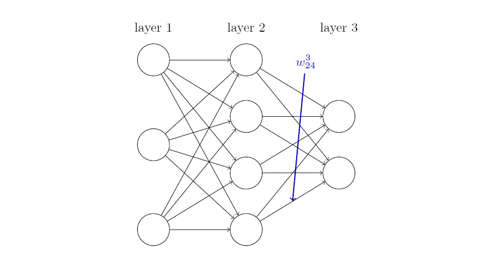
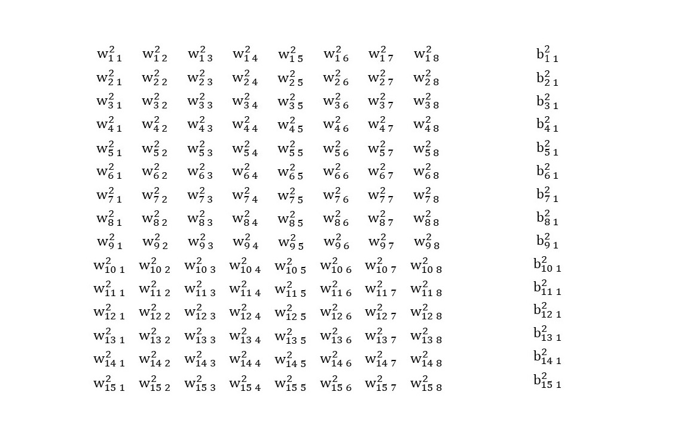
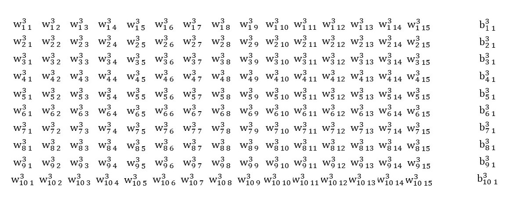

# 9 “驱魔”之反传大法

> “耶和华神用地上的尘土造人，将生气吹在他鼻孔里，他就成了有灵的活人。” —— 创世纪 2:7

上一篇[8 万能函数的形态：人工神经网络](./8-万能函数的形态：人工神经网络.md)解封了人工神经网络，如果用非常简短的语言来概括它，我更喜欢维基百科的诠释：

> 人工神经网络是一种模仿生物神经网络(动物的中枢神经系统，特别是大脑)的结构和功能的数学模型或计算模型，用于对函数进行估计或近似。神经网络由大量的人工神经元联结进行计算。大多数情况下人工神经网络能在外界信息的基础上改变内部结构，是一种自适应系统。

就这样，人类照着上帝创造生灵万物的手法，居然也徒手造出了“活物”，且让它们附体在芯片之中，操纵世事。它们中有庞然大物，有小巧玲珑，不知疲倦，冰冷无情，是为“魔”。（是我看西游·降魔太多遍了-_-!）

然而要驱动那一堆首尾相连的神经元，让其“活”起来，还有最后一个步骤，就像圣经中神造人时吹的那口生气，即本篇要说的**反向传播大法（Backpropagation）**。

## 神经网络有多少参数？

与线性回归的算法框架如出一辙，基于神经网络的机器学习，是基于数据的、运用梯度下降算法来优化网络（减小损失）的过程。

在套用这个算法框架之前，要先搞清楚神经网络的参数及其形式。以经典的3层感知器为例：

第一层是输入层，其中的神经元仅仅提供输出值，并不含有权重和偏置。图中输入层有8个神经元。

第二层是隐藏层，有15个神经元，每个神经元都会接收第一层的8个神经元的输出作为输入，在其内部，加权求和之后还有一个偏置。

第三层是输出层，有10个神经元，每个神经元都会接受第二层的15个神经元的输出作为输入，在其内部，加权求和之后也有一个偏置。

用**wjkl**来表示一个单独的权重，它代表的是第l层的第j个神经元、与上一层（l-1）第k个神经元输出相对应的权重。或许你对这种表示方法感到有些别扭，但很快就会适应的。以w243为例见下图：

用**bjl**来表示第l层上，第j个神经元中的偏置，这个比较显而易见。

基于上述的神经网络结构和对权重和偏置的符号的定义，当前构建的神经网络的参数如下所示：

## 基于神经网络的机器学习

第二层神经元的权重120=15x8个，偏置15个，第三层神经元的权重150=10x15个，偏置10个。整个神经网络的参数：295个。一个不算特别复杂的，由33个神经元构成的全连接神经网络，其参数已经达到了295个之多。

所谓的训练神经网络，就是调整这295个参数，使其对于样本数据，能够让“损失”达到最小。再次回顾二次损失函数的定义（其中n=295）：

接着，套用随机梯度下降算法，调整每个参数(以前两个为例)：

至此，只要求取每个参数对损失函数的偏导数，代入上式即可对参数进行1次优化。可是我们已经知道：神经网络可以近似任意的函数，但却无法知道其代表的函数的确切形式是什么。也就是说，对已知函数求偏导的公式算法，根本用不上。

## 反向传播

从二十世纪40、50年代人工神经元被发明，那一堆首尾相接的神经元沉寂了长达三十年的漫漫长夜。直到1986年，心理学家David Rumelhart，在深度学习的守护者Geoffrey E. Hinton等人的协助下发现了“反向传播”终极大法，它们就要“活”起来了。

贴出大法秘诀一饱眼福:

它由四个基本公式构成，就像所有真理的数学描述一样简洁。仔细看最后两个公式，那不就是损失函数关于神经网络的参数（权值和偏置）的偏导数的表达式吗？而这就是反向传播的核心目的。

至此，[6 解锁梯度下降算法](./6-解锁梯度下降算法.md)中的随机梯度下降算法（Mini-batch SGD）所缺失的梯度值计算终于补上了。一次完整的参数更新步骤如下：

- 确定一个小批量样本；
- 通过网络获得输出并计算损失；
- 反向传播计算损失的梯度；
- 利用梯度更新网络中的参数；

就这样循环上述步骤，直至让损失降到最低，我们的网络就训练好了。