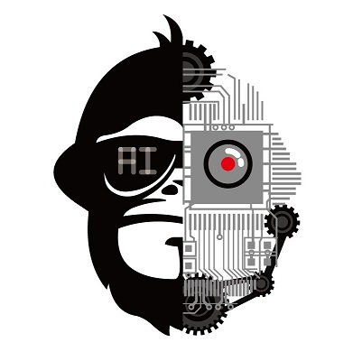

# 0 前言

我是黑猿大叔，转战AI的大叔程序猿，你好。

本篇是《TensorFlow从1到2》的前言，本主题将会涵盖现代卷积网络基础，及其TensorFlow实现。

我将延续先前的承诺：

**它不会止于翻译和笔记、语言和工具，而是坚持通过启发性的方式，循序渐进构建系统化的理解，搭建一个坚实可靠的、连接“零基础”与“AI/机器学习/深度学习”领域之间的缓坡道。**

废话少说，本文的剩余部分仍然提供干货。

## 参考书目

- [Deep Learning](http://www.deeplearningbook.org/)（[开源中译版](https://exacity.github.io/deeplearningbook-chinese/) [中文纸质版](https://book.douban.com/subject/27087503/)），Ian Goodfellow，Yoshua Bengio and Aaron Courville
- [CS231n: Convolutional Neural Networks for Visual Recognition](http://cs231n.stanford.edu/)（[英文讲义](http://cs231n.github.io/) [Demos](http://cs.stanford.edu/people/karpathy/convnetjs/index.html) [项目报告](http://cs231n.stanford.edu/reports.html) [网易云课堂中文字幕](http://study.163.com/course/introduction.htm?courseId=1003223001)），Fei-Fei Li
- [Deeplearning.ai：Deep Learning](https://www.coursera.org/specializations/deep-learning)（[网易云课堂中文字幕](https://mooc.study.163.com/smartSpec/detail/1001319001.htm)），Andrew Ng
- [Neural Networks and Deep Learning](http://neuralnetworksanddeeplearning.com/)（[中译版](https://github.com/zhanggyb/nndl/releases)），Micheal Nielsen
- [TensorFlow实战](https://book.douban.com/subject/26974266/)，黄文坚，唐源
- [机器学习](https://book.douban.com/subject/26708119/)，周志华
- [人工智能](https://book.douban.com/subject/27015112/)，李开复
- [终极算法](https://book.douban.com/subject/26931905/)，佩德罗·多明戈斯

*注：按对主题的影响度排序，持续调整中。*

## 历史回顾：深度学习的三次浪潮

### 第一次浪潮

#### 1943年

- 第一个正式的神经元模型，Warren McCulloch，Walter Pitts，麦卡洛克-皮茨神经元做不了的事情就是学习；

#### 20世纪50年代

- 感知器，Frank Rosenblatt；

#### 1959年

- Receptive Fields of Single Neurones in the Cat's Striate Cortex，Hubel，Wiesel；

#### 1969年

- 线性模型无法解决XOR问题，Minsky，导致了神经网络热潮的第一次大衰退；

---

### 第二次浪潮

#### 1980

- 新认知机，Fukushima 受哺乳动物视觉系统的结构启发，引入了一个处理图片的强大模型架构，它后来成为了现代卷积网络的基础；

#### 1986 

- 反向传播算法，David Rumelhart，Geoffrey E. Hinton，Ronald J. Williams；

#### 1989 

- George Cybenko，证明神经网络的普遍性定理；

#### 1995年

- 卡内基-梅隆大学的研究员就已经成功训练出一台多层感知器来驾驶汽车，方法就是探测视频图像中的路面，然后适当转动方向盘，其完成了“横穿美国的实验”；

#### 1998年

-  Gradient-based learning applied to document recognition，Yann LeCun and Yoshua Bengio，现代卷积网络开创性论文，提出第一个正式的卷积神经网络架构LeNet5；
- 图模型，Jordan，在很多重要任务上实现了很好的效果，导致神经网络热潮的第二次衰退；

#### 1999年

- 核方法，在很多重要任务上实现了很好的效果，导致神经网络热潮的第二次衰退；

#### 2001年

- Gradient flow in recurrent nets: the difficulty of learning long-term dependencies，Yoshua Bengio，讨论了“消失的梯度问题”；

#### 2004-2005 

- DARPA大挑战中，无人驾驶汽车才进入公众视野；

---

### 第三次浪潮

#### 2006年

- 《Reducing the dimensionality of data with neural networks》，Hinton；
- 《基于深度置信网络的快速学习方法》， Hinton；
- Yann Lecun，阐述深度学习如何能跟当年流行的图模型（比如条件随机场）等价；

#### 2010年

- Context-Dependent Pre-trained Deep Neural Networks for Large Vocabulary Speech Recognition，George Dahl，Dong Yu，Li Deng，Alex Acero；

#### 2012年 

- Imagenet classification with deep convolutional neural networks，Alex Krizhevsky，Ilya Sutskever，Geoff Hinton；
- ImageNet冠军，AlexNet（KSH） 8层；

	- 冠军获得者：Geoff Hinton的博士生Alex Krizhevsky和Ilya Sutskever，将错误率从26.%降到15.3%；
	- Alex和Ilya竞赛用的正是Yann Lecun发明的卷积神经网络，但结果刚出来时，Yann和他的NYU实验室成员甚至没法重复Geoff Hinton的结果；
	- Google团队（包含Andrew Ng和Jeff Dean）做了非公开测试，识别精度比Geoff Hinton差了很多；
	- 工业界对深度学习的追捧传递回学术界发生在一年以后，原因是除了顶级教授因为私人关系能知道工业界最前沿进展，大部分学术界教授并没有公开渠道及时获取信息；
	- 在NIPS（机器学习顶级年度会议），Google竞价超过微软等公司，收购了Alex、Ilya和Geoff刚注册几个月的公司，还花了5000万美元买了三个人的部分时间；
	- Facebook挖了Yann Lecun，他在纽约领导成立了Facebook AI lab；

- James Bergstra，Yoshua Bengio，对网格搜索超参数进行了综述；

#### 2014年 

- 5月16日，Andrew Ng离开Google加入Baidu；
- On the number of response regions of deep feed forward networks with piece-wise linear activations，Yoshua Bengio，对于某些问题和网络结构给出了“深度网络在本质上比浅层网络更加强大”的证明；
- VGG 19层，ImageNet 2014亚军；
- GoogLeNet，22层，ImageNet 2014冠军；

#### 2015年

- ResNet，152层，Microsoft，ImageNet 2015冠军；

#### 2016年

- AlphaGo战胜李世石，人工智能元年开启；